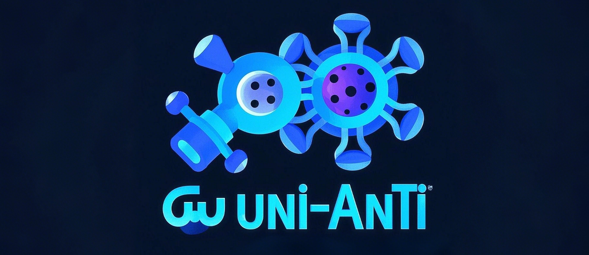
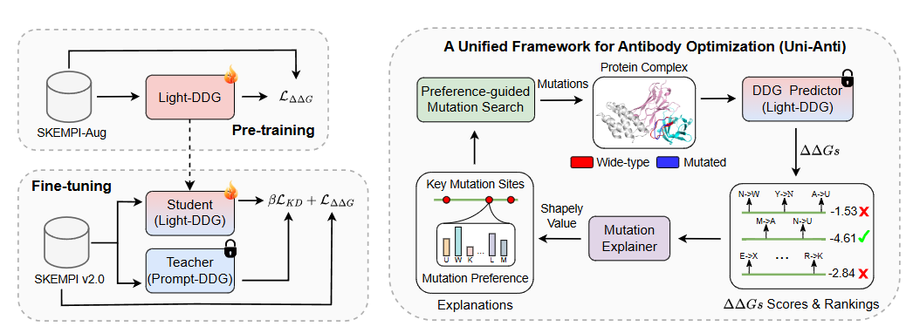
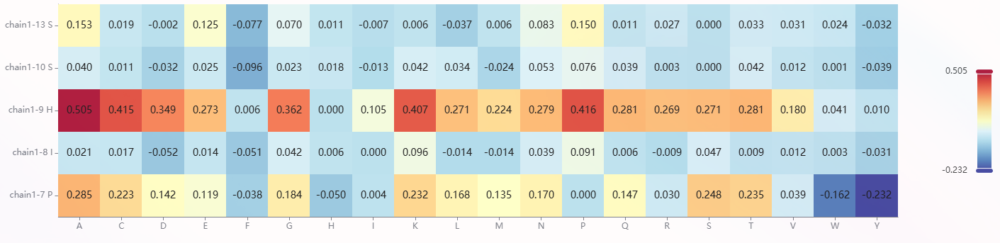
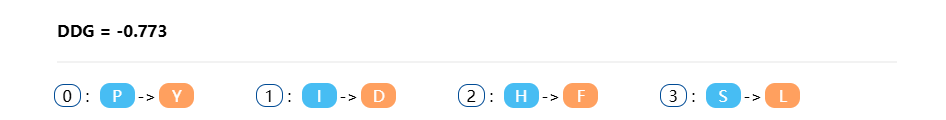

<p align="center">
  
</p>

<h3 align="center">Uni-Anti: A Unified Framework for Antibody Optimization</h3>

<h6 align="center">Lirong Wu, Yunfan Liu, Haitao Lin, Yufei Huang, Guojiang Zhao, Zhifeng Gao, Stan Z. Li. In <a href="https://openreview.net/forum?id=IxmWIkcKs5">ICLR</a>, 2025.</h6>

<h3 align="center">A Free-to-use Online <a href="http://www.manimer.com:9090/antibody">Platform</a> is released!</h3>


## About The Project

This paper shifts the research focus from generating mutations to evaluating mutational effects and indirectly explores the underlying fitness landscape by focusing on regions where DDGs are minimized. We train a simple but effective DDG predictor (Light-DDG) by data augmentation and distillation. Furthermore, we show that Light-DDG can serve as a good optimizer and explainer within a Unified framework for Antibody optimization (Uni-Anti).

<p align="center">
  <center>
  
  </center>
</p>


## **[Platform Usage](http://www.manimer.com:9090/antibody)**

We have developed a free-to-use online [platform](http://www.manimer.com:9090/antibody) to help researchers with three tasks related to antibody design.

####  Task 1 — Evaluation: DDG Prediction (LightDDG)

Optionally given a protein complex structure (pdb file), it predicts the change in binding free energy (∆∆G Prediction) of protein complexes upon interested mutations.

#### Task 2 — Explaination: Mutation Preference

Optionally given a protein complex structure (pdb file) as well as the mutation sites of interest, it explains the mutation preferences of these sites.

<p align="center">
  <center>
  
  </center>
</p>

#### Task 3 — Optimization: Directed Evolution

Optionally given a protein complex structure (pdb file) as well as the mutation sites of interest, it searches for mutations that minimize ∆∆Gs and outputs optimized protein sequences and structures.

<p align="center">
  <center>
  
  </center>
</p>


## Dependencies

```
conda env create -f environment.yml
conda activate Uni-Anti
```
The default PyTorch version is 1.8.1 and cudatoolkit version is 11.3. They can be changed in `environment.yml`.


## Dataset

| Dataset                                      | Download Script                                    | File Directory  |
| -------------------------------------------- | -------------------------------------------------- | --------------- |
| [SKEMPI v2](https://life.bsc.es/pid/skempi2) | [`data/get_skempi_v2.sh`](./data/get_skempi_v2.sh) | SKEMPI_v2_cache |
| SKEMPI-Aug                                   | /                                                  | SKEMPI_v2_aug   |
| SKEMPI-KD                                    | /                                                  | SKEMPI_v2_kd    |


## Usage

### Pre-training, Fine-tuning, and KD on three SKEMPI datasets

```
python -B train.py
```

The customized hyperparameters  are available in `./configs/param_config.json`.


### Loading the Pre-trained Model and Making Inference

We provide a pre-trained model in [`trained_models`](./trained_models/best.ckpt), you can load it for inference

```
python -B evaluate.py --task_type {task}
```

Four tasks are currently supported:

(1) validation: testing on the validation set of SKEMPI v2.0; 

(2) prediction: predicting DDGs for mutations of interest; 

(3) explaination: learning mutation preferences for the sites of interest; 

(4) optimization: optimizing the sites to produce better antibodies.


## Citation

If you are interested in our papers, or if you use our platform in your research, please cite the following papers:

```
@article{wu2024learning,
  title={Learning to Predict Mutation Effects of Protein-Protein Interactions by Microenvironment-aware Hierarchical Prompt Learning},
  author={Wu, Lirong and Tian, Yijun and Lin, Haitao and Huang, Yufei and Li, Siyuan and Chawla, Nitesh V and Li, Stan Z},
  journal={arXiv preprint arXiv:2405.10348},
  year={2024}
}
```
```
@inproceedings{wu2025simple,
  title={A Simple yet Effective \${\textbackslash}Delta{\textbackslash}Delta G\$ Predictor is An Unsupervised Antibody Optimizer and Explainer},
  author={Wu, Lirong and Liu, Yufan and Lin, Haitao and Huang, Yufei and Zhao, Guojiang and Gao, Zhifeng and Li, Stan Z},
  booktitle={The Thirteenth International Conference on Learning Representations},
  year={2025},
  url={https://openreview.net/forum?id=IxmWIkcKs5}
}
```

## Feedback

If you have any issue about this work or plat, please feel free to contact me by email: 
* Lirong Wu: wulirong@westlake.edu.cn
